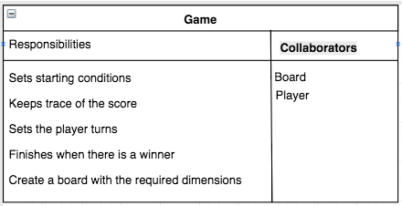
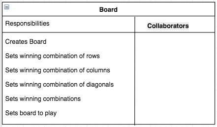
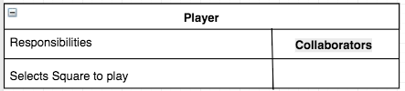

# Tic-Tac-Toe

The aim of this tech test is to build the business logic for the game of tic tac toe.

This game can be played with any kind of square tables, the user can choose the dimension of the board before starting the game. The winning score is calculated according to the board dimensions, for example if the table dimension is 3 there will be 8 winning combinations, or if the table dimension is 4 there will be 10 winning combinations, and so on.

## Game Rules

The rules of tic-tac-toe are as follows:

- Set the table dimensions
- There are two players in the game (X and O)
- Players take turns until the game is over
- A player can claim a field if it is not already taken
- A turn ends when a player claims a field
- A player wins if they claim all the fields in a row, column or diagonal
- A game is over if a player wins
- A game is over when all fields are taken

## Tech Stack

This game has been written in JavaScript.

## Running Testing
Testing is in Jasmine. To run the tests, open 'SpecRunner.html' in the browser.

## Design Process

